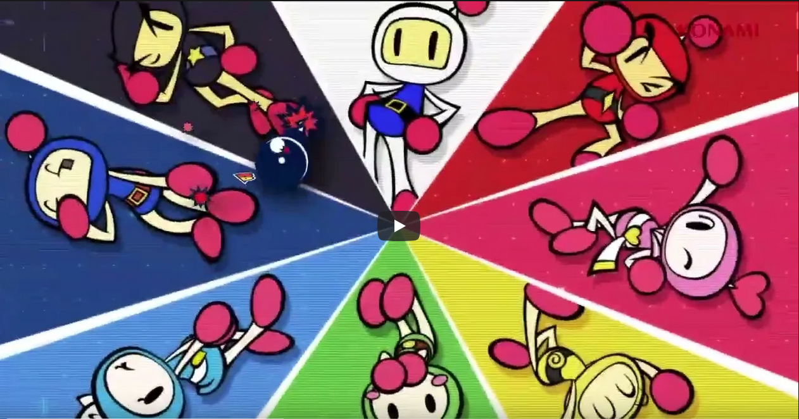

# {EPITECH} | Second year | OOP | ECS | Indie Studio

## The project :

The purpose of the Indie Studio project is to recreate the cross-platform video game Bomberman. In the game, you have to control a character to kill the other players on the map with bombs.

Our gameplay reference is Neo Bomberman, released on the MVS, and our design is inspired from the Switch game Super Bomberman R released in 2017.

- `Tools`:
    * Project made in `C++` version 20, `Raylib` and `Blender` version 3.2.0
    * Compiled with `CMake`, minimum version required : `3.6`
    * Can be compiled either on `Windows` or `Linux` distributions
    * A `justfile` is provided to compile it

- `Some of the features we implemented:`
    * A local multi-player module to play with up to 3 friends or AI’s controlled bots.
    * 3D graphics mixed with a 2D gameplay and procedurally generated maps.
    * A generic entity component system and game engine.

For further details about the implementation of these notions, you can click [here](./documentation) to be redirected to our documentation.

## Usage:

- `How to compile the project:`
    * To build on debug mode : `mkdir build && just debug`<brk>

    * To build on release mode : `mkdir build && just build`<brk>
    * To run the game : `cd build && ./bomberman`